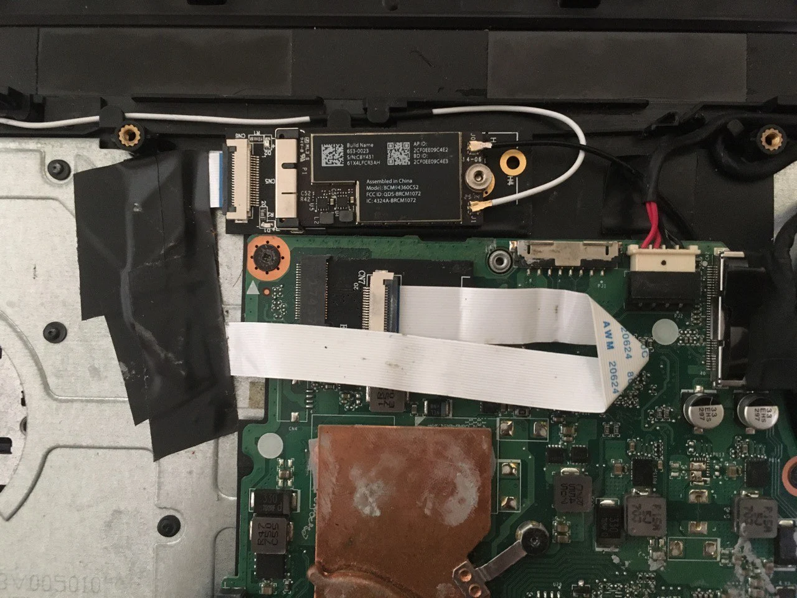

# Acer E5-476G

## Specifications

- Processor: Intel Core i3-6006U @2.0GHz
- Memory: 8GB DDR4 Dual Channel @2133MHz
- Integrated GPU: Intel HD Graphics 520
- Discrete GPU: Nvidia MX130
- Audio: Realtek ALC255
- Storage: Samsung 860 EVO 500GB
- Ethernet Card: Realtek RTL8111
- Wireless Card: Intel 3168NGW
- Touchpad: ELAN0501 I2C
- Keyboard: PS2 Keyboard
- Resolution: 1366x768@60Hz
- Bootloader: OpenCore 0.6.3 RELEASE
- OS Version: macOS 10.15.7 Catalina (19H15)
- SMBIOS: MacBookPro13,1

## Working

- Power Management, idle @500-800MHz
- Shutdown, Restart, Sleep
- QE/CI Intel HD Graphics 520
- Intel Wireless
- Brightness
- Battery up to 6 hours
- Ethernet RTL8111
- Trackpad Full gestures
- Keyboard
- USB 3.0
- VGA Port
- HDMI Port + HDMI Audio out
- Speaker + Combo Jack Headphone

## Not Working

- Nvidia MX130 (Optimus)
- Combo Jack Microphone
- SD Card reader (USB Interface, not supported yet)
- Facetime, iMessage (need to call Apple Support, seems like my Apple ID has been blocked for this device for attempt at my first build)
- DRM broken, only can play FairPlay 1.x

## Notes
- Remap Brightness keys to Fn+PrtScr & Fn+Pause Break. And Volume keys to Fn+F11 (NumLock) & Fn+F12 (ScrLock). And i am also disable Fn+Arrow key, you can see SSDT-PS2K to change this if you don’t like my mapping.
- Mine have disabled CFG Lock, so Kernel patch for CfgLock in config.plist have been disabled. Enable Kernel patch for CfgLock if yours not disabled yet. I had write the guide in my blog (Bahasa Indonesia) [Disable CFG Lock pada Acer E5-476G](https://blog.akhmad.id/disable-cfg-lock-pada-acer-e5-476-g/).

## Images

This is how BCM94360CS2 installed to the board.

## Credit

- Acidanthera team
- Alexandred and VoodooI2C team
- OpenIntelWireless team
- RehabMan
- Andres
- And many other people in hackintosh community
